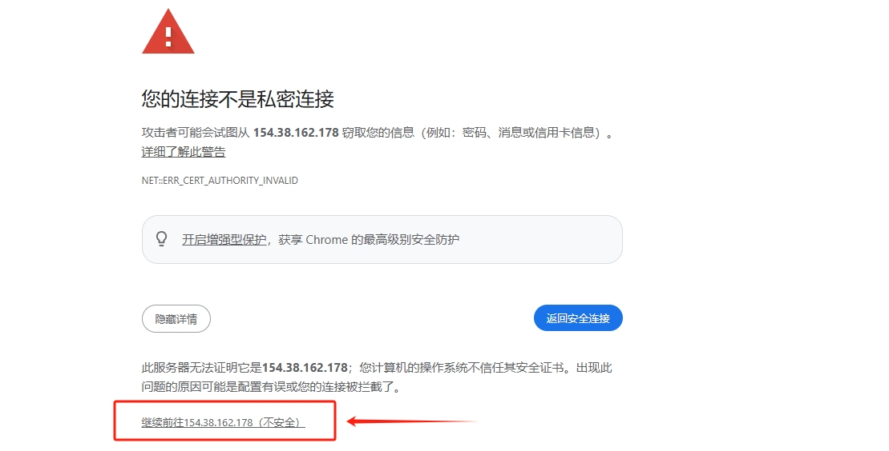

# SHARDEUM

## 如何通过 Node-X 平台部署  Shardeum节点？

#### 1. 获取 Node-X 账号及部署节点

首先，你需要一个 Node-X 账号。如果你还没有账号，请前往 [Node-X 注册页面](https://node-x.xyz) 注册。注册成功后，按照以下步骤购买并上传资源部署节点,下面举个例子：

<figure><figcaption>
选择需要部署的项目
</figcaption></figure>

<figure><figcaption>
点击部署
</figcaption></figure>

<figure><figcaption>
确认支付
</figcaption></figure>

<figure><figcaption>
点击上传信息
</figcaption></figure>

<figure><figcaption>
点击“添加”，上传对应的信息
</figcaption></figure>

### 下方是SHARDEUM节点所需的信息：

**1.领水：**

[前往DC](https://discord.com/invite/shardeum),进入DC，点击显示所有频道后，在Faucet中获取$SHM。

<figure><figcaption>
完成图中的指南
</figcaption></figure>

<figure><figcaption>
点开下拉列表
</figcaption></figure>

<figure><figcaption>
显示所有频道
</figcaption></figure>

<figure><figcaption>
按上图所示领水
</figcaption></figure>

#### 2. 等待服务与查看官方面板

领水成功后，Node-X 将为你部署 **Shardeum-Validator** 节点。通常情况下，这个过程会在24小时内完成。你可以通过以下方式实时查看节点状态：

1. **根据返回的http://\<IP>:<端口>进入面板进行质押等操作**：\
   在 Node-X 平台下单部署完成后，我们会为你提供运行节点的面板链接以及密码,根据下方提示完成操作。

<figure><figcaption>
在URL栏输入给你的链接回车可能就是这样的界面，根据上面的步骤进入就行
</figcaption></figure>

<figure><figcaption>
输入我们返回的密码登录
</figcaption></figure>

<figure><figcaption>
完成这四个步骤，可能有点慢也可能出错，可以多试试
</figcaption></figure>

<figure><figcaption>
这样就行啦
</figcaption></figure>

<figure><figcaption>
前往面板
</figcaption></figure>

<figure><figcaption>
这里就可以查看节点状态
</figcaption></figure>

<figure><figcaption>
这里可以修改密码
</figcaption></figure>

<figure><figcaption>
这样就是待机状态啦
</figcaption></figure>

<figure><figcaption>
要达到这样的验证状态最快大概两三天时间，请耐心等待！
</figcaption></figure>

#### 结语

通过 Node-X 平台部署 Shardeum-Validator节点就是这么简单！希望这篇指南对你有所帮助。

如果你有任何问题或需要进一步的指导，欢迎留言或私信我。加油！一起探索区块链的世界吧！ 🚀
