# Spheron Protocol

<a href="https://docs.node-x.xyz/en/product-manual/one-click-deployment/spheron-protocol">English</a>

## 如何通過 Node-X 平台部署 Fizz節點？

### 1. 獲取 Node-X 帳號及部署節點

首先，你需要一個 Node-X 帳號。如果你還沒有帳號，請前往 [Node-X 註冊頁面](https://node-x.xyz/) 註冊。註冊成功後，依照以下步驟購買並上傳資源部署節點,以下舉個例子：

<figure><figcaption></figcaption></figure>

<figure><figcaption></figcaption></figure>

<figure><figcaption></figcaption></figure>

### 2.填寫參數

#### 1.完成领水和注册并下载脚本

需要Spheron Testnet的測試幣，可以用Arbitrum Sepolia 通過[Spheron Bridge](https://spheron-devnet-eth.bridge.caldera.xyz/)swap過來。

<figure>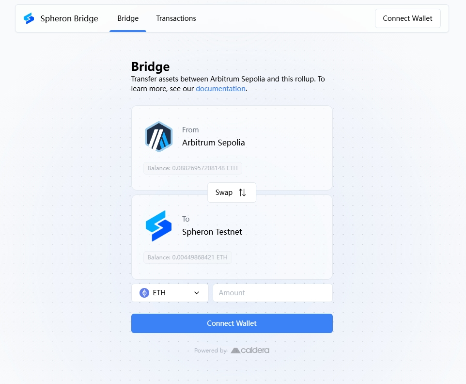<figcaption></figcaption></figure>

若你沒有Arbitrum Sepolia 測試幣，可以用ETH Sepolia通過[Arbitrum Bridge](https://bridge.arbitrum.io/?destinationChain=arbitrum-sepolia\&sourceChain=sepolia)轉換。

<figure>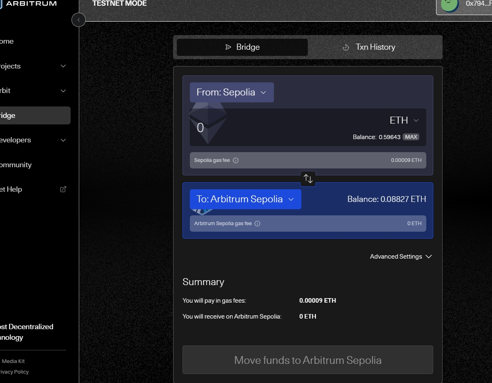<figcaption></figcaption></figure>

下單用戶可直接到Node-X的TG(t.me/nodex527)免費領取ETH Sepolia。

完成領水後，打開[註冊界面](https://fizz.spheron.network/)，然後跟著下方圖片進行註冊並下載腳本。

<figure>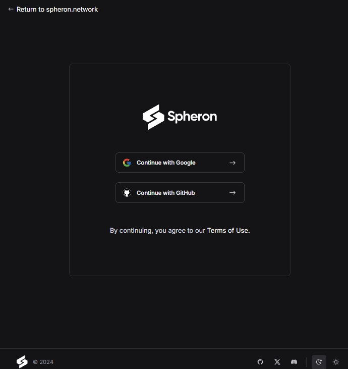<figcaption>
使用邮箱注册
</figcaption></figure>

<figure>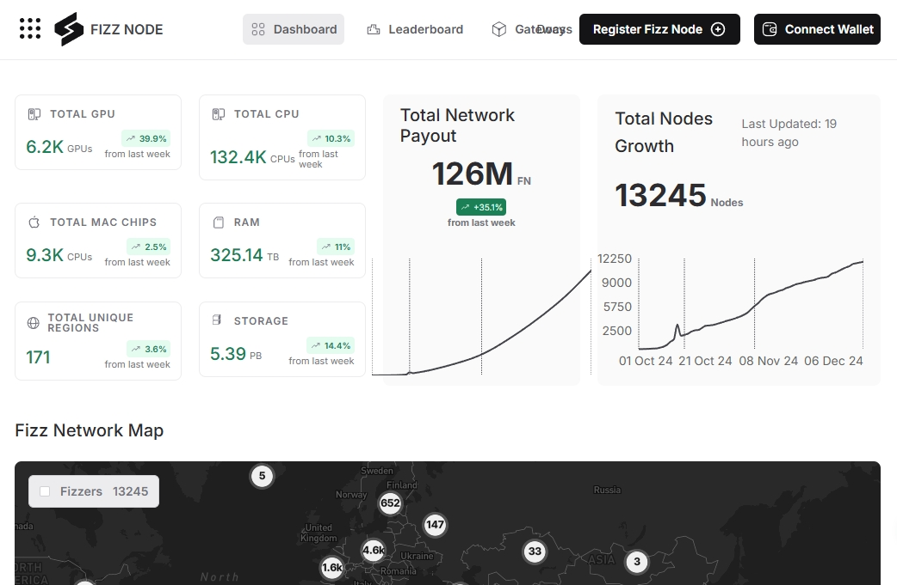<figcaption></figcaption></figure>

<figure>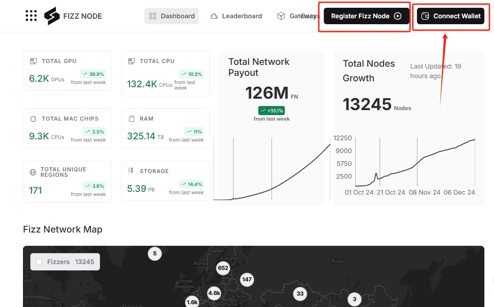<figcaption>
连接钱包
</figcaption></figure>

<figure>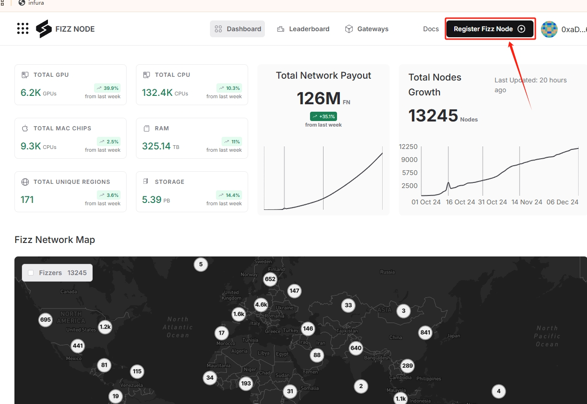<figcaption>
注册节点
</figcaption></figure>

<mark style="color:red;">註：資源分配我們預設為Linux 4CPU 8GB RAM 100GB Storage。注意不要分配錯誤哦！</mark>

**若分配的資源與實際配置資源不符，會每天扣除你的獎勵。**

<figure>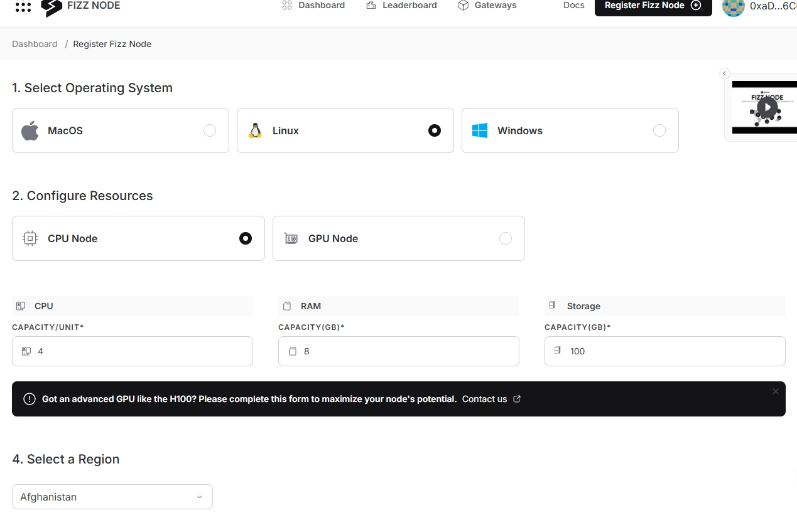<figcaption>
分配资源
</figcaption></figure>

<figure>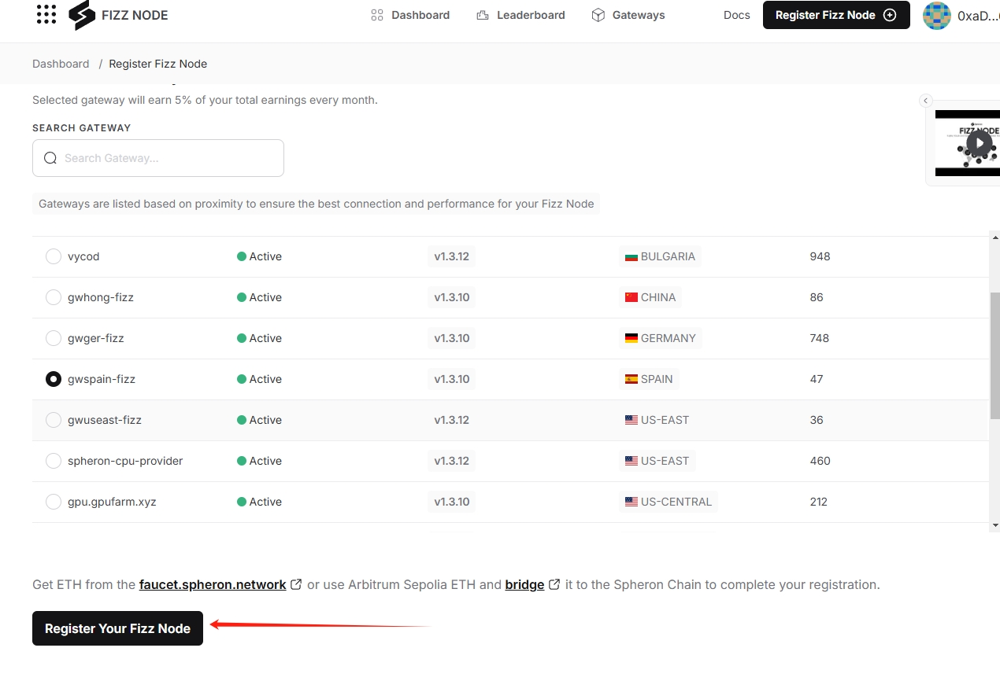<figcaption>
点击注册节点
</figcaption></figure>

<figure>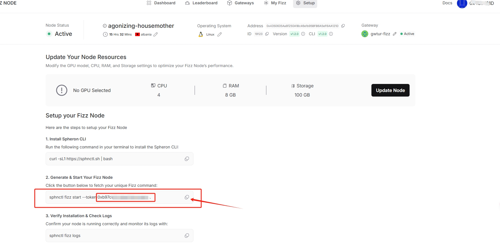<figcaption>
从这里获取token
</figcaption></figure>

#### 2. 等待服務與查看官方面板

購買成功後，Node-X 將為您部署 Fizz節點。通常情況下，這個過程會在24小時內完成。你可以透過以下方式即時查看節點狀態：

1. **檢視節點狀態**：\
   在 Node-X 平台的使用者面板中，你可以看到所有已購買的節點及其當前狀態。
2. **項目方面板查看**：\
   節點配置完成後，可透過[官方面板](https://fizz.spheron.network/) 更新有延遲。

<figure>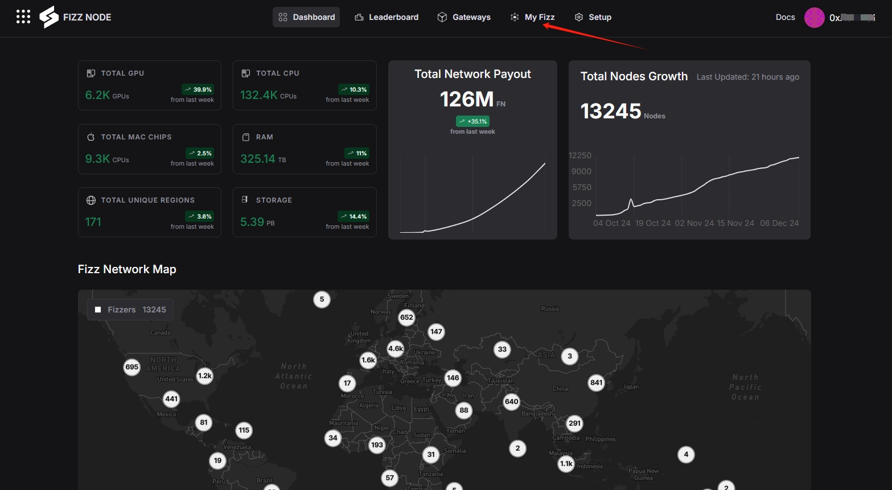<figcaption>
点击My Fizz
</figcaption></figure>

<figure>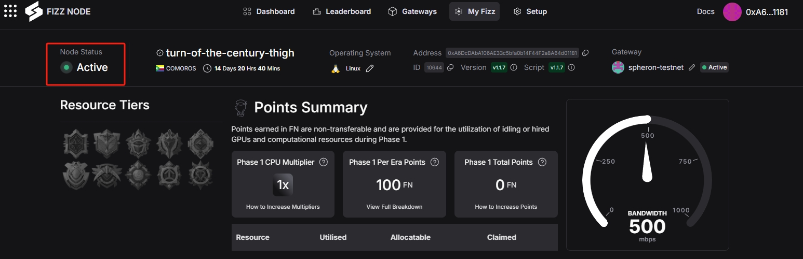<figcaption>
查看奖励情况以及运行状态
</figcaption></figure>

## **結語**

透過 Node-X 平台部署 Fizz節點就是這麼簡單！希望這篇指南對你有幫助。

如果你有任何問題或需要進一步的指導，歡迎留言或私訊我。加油！一起探索區塊鏈的世界吧！ 🚀
