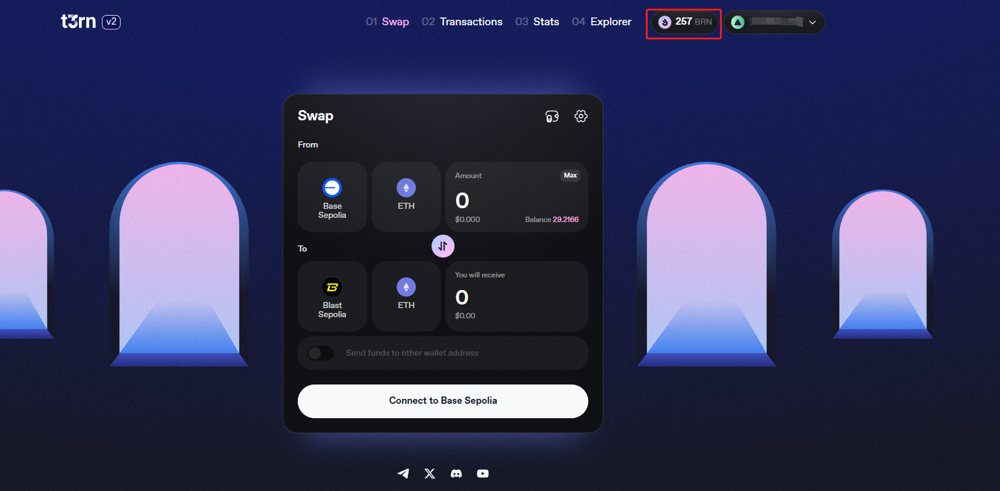

# T3RN V2

## 如何通过 Node-X 平台部署  T3RN V2-EXECUTOR节点？

#### 1. 获取 Node-X 账号及部署节点

首先，你需要一个 Node-X 账号。如果你还没有账号，请前往 [Node-X 注册页面](https://node-x.xyz) 注册。注册成功后，按照以下步骤购买并上传资源部署节点,下面举个例子：

<figure><figcaption>
选择需要部署的项目
</figcaption></figure>

<figure><figcaption>
点击部署
</figcaption></figure>

<figure><figcaption>
确认支付
</figcaption></figure>

<figure><figcaption>
点击上传信息
</figcaption></figure>

<figure><figcaption>
点击“添加”，上传对应的信息
</figcaption></figure>

### 下方是T3RN节点所需的信息：

**1.下单成功后提供存储有Base sepolia ETH、OP sepolia ETH、ARB sepolia ETH的钱包（EVM）私钥。**

&#x20;       下单完成后，需要在Base sepolia ETH、OP sepolia ETH 、ARB sepolia ETH、Unichain sepolia这几条链上拥有一定的测试币(差不多10多个ETH就能正常运行)，存入您准备跑该项目的EVM钱包中，下面是几个推荐的桥（建议直接拿三种币中的一种，然后通过官方的桥桥接到其他几种币，可以获取更多奖励）：

（1）[soneium bridge](https://superbridge.app/soneium-minato)

（2）  (官方)[t2rn bridge](https://bridge.t2rn.io/)

（3）[Arbitrum bridge](https://bridge.arbitrum.io/?destinationChain=arbitrum-sepolia\&sourceChain=sepolia)

**2.运行时需要RPC及领水**\
RPC我们运行的时候默认使用的是公共的RPC（不是很稳定），若想要提高稳定性可以前往[ZAN](https://zan.top/)或其他RPC的地方获取私人的rpc(infura获取的免费RPC容易请求频繁)，具体可参考[其他一样获取RPC的文档](https://docs.node-x.xyz/chan-pin-shou-ce/yi-jian-bu-shu/waku)，需要的RPC有Base-sepolia、OP-sepolia、ARB-sepolia、Blast-sepolia、Unichain sepolia、Blast sepolia这几个。

<mark style="color:red;">还需要</mark>[<mark style="color:yellow;">**前往官方水龙头**</mark>](https://b2n.hub.caldera.xyz/)<mark style="color:red;">领取0.1brn的测试币，不然无法运行。</mark>

#### 3. 等待服务与查看官方面板

购买成功后，Node-X 将为你部署 **T3RN V2——executor**节点。通常情况下，这个过程会在24小时内完成。你可以通过以下方式实时查看节点状态：

1. **查看节点状态**：\
   在 Node-X 平台的用户面板中，你可以看到所有已购买的节点及其当前状态。
2. **通过官方面板查看节点奖励**

[前往官网](https://bridge.t2rn.io/)，连接钱包后，就能查看到节点运行为止，赚取的奖励。

<figure><figcaption>
查看奖励
</figcaption></figure>

#### 结语

通过 Node-X 平台部署 **T3RN V2——executor**节点就是这么简单！希望这篇指南对你有所帮助。

如果你有任何问题或需要进一步的指导，欢迎留言或私信我。加油！一起探索区块链的世界吧！ 🚀
