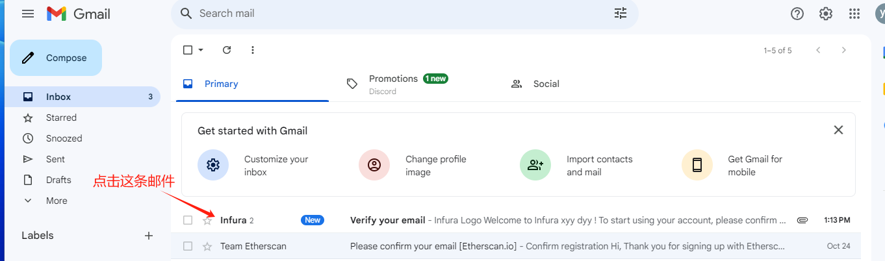

# WAKU

## 如何通过 Node-X 平台部署 waku节点？

#### 1. 获取 Node-X 账号及部署节点

首先，你需要一个 Node-X 账号。如果你还没有账号，请前往 [Node-X 注册页面](https://node-x.xyz) 注册。注册成功后，按照以下步骤购买并上传资源部署节点,下面举个例子：

<figure><figcaption>
选择需要部署的项目
</figcaption></figure>

<figure><figcaption>
点击部署
</figcaption></figure>

<figure><figcaption>
确认支付
</figcaption></figure>

<figure><figcaption>
点击上传信息
</figcaption></figure>

<figure><figcaption>
点击“添加”，上传对应的信息
</figcaption></figure>

### 下方是WAKU节点所需的信息：

#### 1. 完成领水并提供EVM钱包(如：小狐狸)私钥以及ETH Sepolia RPC

在购买资源后，你需要提供1个 EVM钱包私钥以及1个ETH Sepollia RPC：

1. **测试网节点领水**：\
   钱包中需要至少0.6**sepoliaETH,**&#x5982;果**sepoliaETH**不足，可前往[TG](https://t.me/nodex527/2244)领取，<mark style="color:red;">**请注意一定要先领水，否则部署会失败**</mark>。
2. 到INFURA获取RPC\
   [点击这里](https://developer.metamask.io/register)前往INFURA注册为INFURA用户，然后获取RPC。

<figure><figcaption></figcaption></figure>

<figure><figcaption></figcaption></figure>

<figure><figcaption></figcaption></figure>

<figure><figcaption></figcaption></figure>

<figure><figcaption></figcaption></figure>

<figure><figcaption></figcaption></figure>

<figure><figcaption></figcaption></figure>

<figure><figcaption>
根据自己的情况选择
</figcaption></figure>

<figure><figcaption></figcaption></figure>

<figure><figcaption></figcaption></figure>

1. **下载模板填写EVM钱包私钥和ETH Sepolia RPC**：\
   下载模板填写**领过水**的**EVM私钥和ETH Sepolia RPC**并上传，全程加密传输且不经过人工，安全可保证。
2. **发起聊天（可选）**：\
   在**我的订单**中找到聊天功能，点击发起聊天，并在聊天中提供相关信息。

#### 2. 等待服务与查看官方面板

购买成功后，Node-X 将为你部署节点。通常情况下，这个过程会在24小时内完成,完成后我们会为你提供服务器的IP地址。你可以通过以下方式实时查看节点状态：

1. **查看节点状态**：\
   在 Node-X 平台的用户面板中，你可以看到所有已购买的节点及其当前状态。
2. **项目方面板查看**：\
   节点配置完成后，可以通过“http://**<\<IP>>**:3000/d/yns\_4vFVk/nwaku-monitoring”查询节点状态，更新有延迟。

#### 结语

通过 Node-X 平台部署waku节点就是这么简单！希望这篇指南对你有所帮助。

如果你有任何问题或需要进一步的指导，欢迎留言或私信我。加油！一起探索区块链的世界吧！ 🚀
